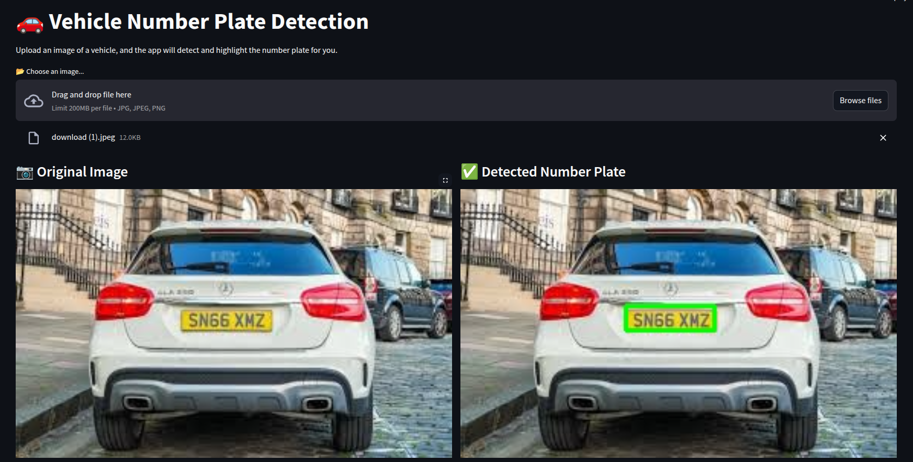

# 🚗 Vehicle Number Plate Detection System with YOLOv8

## 🎉 Introduction

Welcome to the **Vehicle Number Plate Detection System**! 🚗 This project leverages the powerful YOLOv8 framework to accurately detect vehicle number plates in images. Whether you're developing traffic management solutions, parking lot systems, or security surveillance tools, this system provides a robust foundation for your computer vision applications.

---

## ✨ Features

- **High Accuracy**: Achieves a Mean Average Precision (mAP) of **99.2%**.
- **Real-Time Detection**: Optimized for fast inference suitable for real-time applications.
- **User-Friendly Interface**: Built with Streamlit for easy interaction and visualization.
- **Scalable Training Pipeline**: Utilize Google Colab for efficient model training with GPU support.
- **Comprehensive Documentation**: Detailed README and usage guides to help you get started quickly.
- **Robust Error Handling**: Informative messages to guide users through any issues.

---

## 🎥 Demo



_Figure 1: Streamlit App Interface showcasing original and detected number plates._

---

## 📁 Dataset

### 🔍 Dataset Details

- **Source**: [Roboflow Project - YOLO Unszn](https://universe.roboflow.com/dronacharya-college-of-engineering/yolo-unszn)
- **Version**: 3
- **Total Images**: 1,050
- **Annotations**: Bounding boxes around number plates
- **Image Formats**: JPG, JPEG, PNG

### 💾 Accessing the Dataset

To access and download the dataset, use the following script:

```python
from roboflow import Roboflow

# Initialize Roboflow
rf = Roboflow(api_key="paste_your_api_key_here")

# Access the specific project and version
project = rf.workspace("dronacharya-college-of-engineering").project("yolo-unszn")
dataset = project.version(3).download("yolov8")
```

## 💻 Usage

## 🔧 Prerequisites

- 🖥️ **Python 3.10** or higher
- 📦 pip package manager
- 🌐 Streamlit installed globally or in a virtual environment

## 📦 Installation

### 🔗 Clone the Repository

```bash
Copy code
git clone https://github.com/alphatechlogics/CarNumberPlateDetection.git
cd CarNumberPlateDetection
```

### 🐍 Create a Virtual Environment (Optional but Recommended)

```bash
python3 -m venv venv
source venv/bin/activate  # On Windows: venv\Scripts\activate
```

### 📦 Install Dependencies

```bash
pip install -r requirements.txt
```

### 🚀 Running the Streamlit App

- 💾 Ensure the Trained Model is Available
- Place the `best.pt` model file in the root directory of the project or specify its path in app.py.

```bash
streamlit run app.py
```

### 🌐 Access the App

- Open your web browser and navigate to http://localhost:8501.

### 🖼️ Using the App

- **Upload an Image:** Click on the "📂 Choose an image..." button to upload a JPG, JPEG, or PNG image.
- 🔍 **Detect Number Plate:** Click the "🔍 Detect Number Plate" button to perform detection.
- 📷 **View Results:** The original image and the detected number plate will be displayed side by side.
